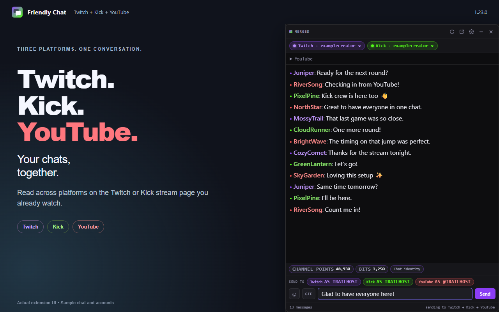
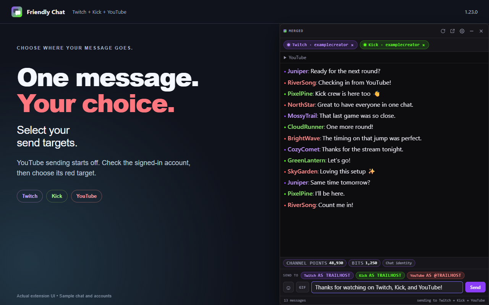
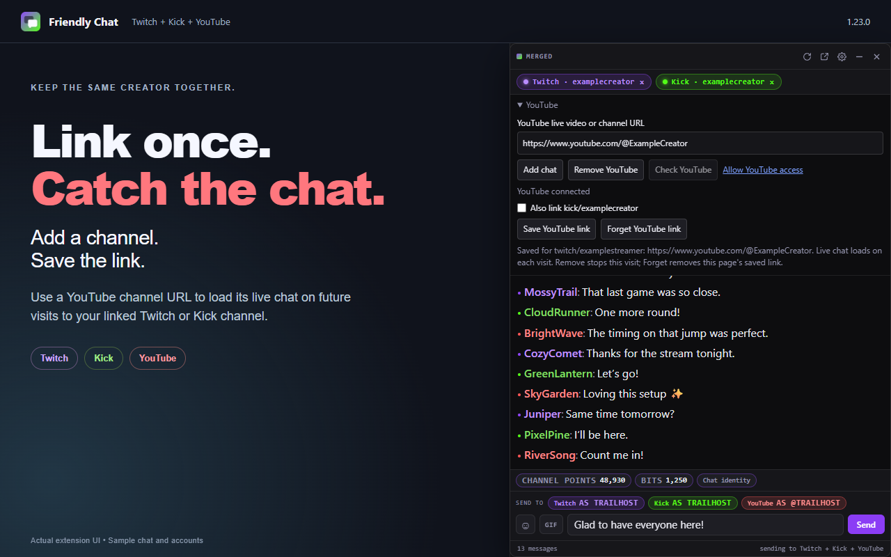
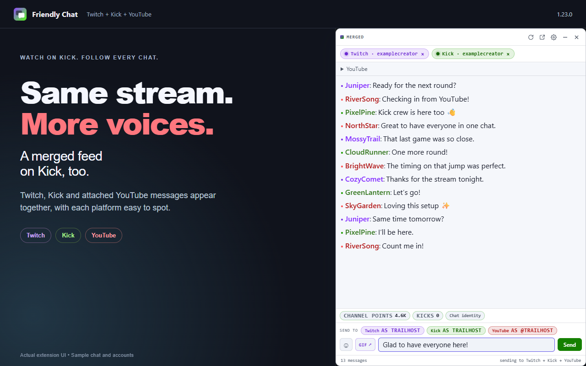
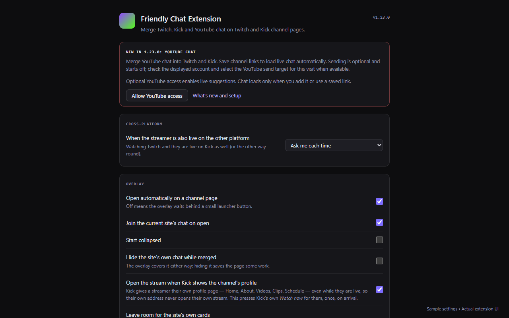

# Friendly Chat 1.23.0 — Chrome Web Store screenshots

Five upload-ready screenshots, captured September 27, 2026 (UTC). Each is a 1280 × 800 RGB PNG with no alpha channel. Upload the numbered files in this order:

1. [Twitch, Kick and YouTube in one feed](01-three-platform-chat.png)
2. [Choose your send targets](02-youtube-sending.png)
3. [Save a YouTube channel link](03-saved-youtube-links.png)
4. [Merged chat on Kick in the light theme](04-kick-merged-chat.png)
5. [Optional YouTube access in settings](05-youtube-access-settings.png)

## Capture notes

These are actual extension HTML/CSS interface renders from the released 1.23.0 source, using the repository's isolated overlay and options harnesses in installed Chrome. The outer captions are promotional framing; the chat controls, messages, send targets and settings are rendered by the extension itself. Sample usernames, conversations, platform accounts, balances and channel URLs are synthetic. They are not a live Twitch/Kick/YouTube session or evidence of a real user's identity.

The YouTube batch callback populates the real merged feed, and a local source fixture provides connected/signed-in state. Trusted browser clicks select the YouTube send target and exercise the saved-link UI. All external requests were blocked. No live messages, personal browser profile, credentials, payment activity or real settings were used. The capture utility changed only the isolated page fixtures and sample state; extension runtime files were not edited.

Verified: five screenshots, PNG dimensions/color mode, visible YouTube rows, selected YouTube target, saved-link confirmation, no page errors in the overlay captures, and visual inspection of each image. `capture-results.json` records the fixture assertions. Screenshots do not replace the required store icon or promotional tile.

[Chrome screenshot guidance](https://developer.chrome.com/docs/webstore/images) · [Store listing and privacy copy](../../store-listing/1.23.0/CHROME-WEB-STORE.md)
